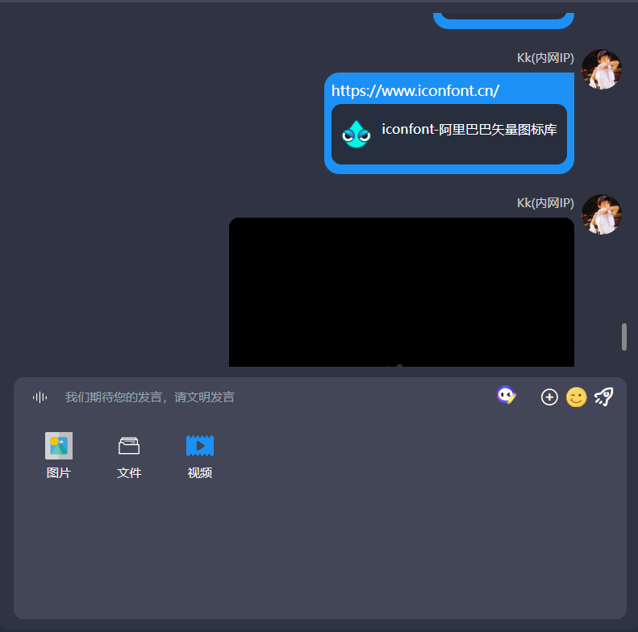
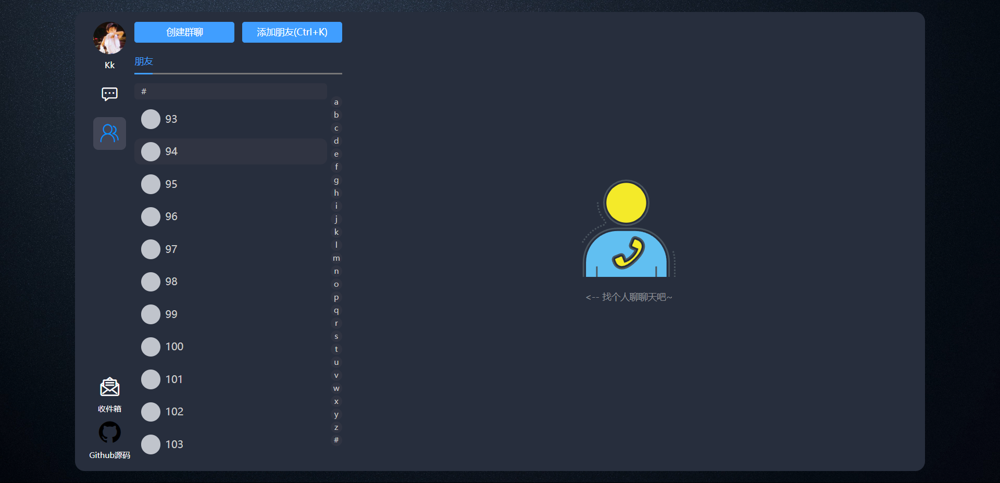
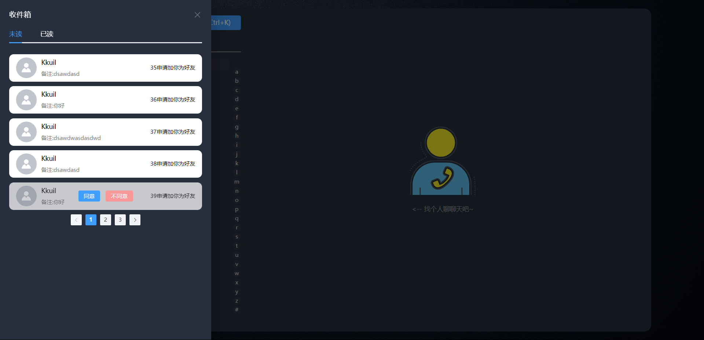

# BlackChat 🚀

BlackChat是一个黑色主题的IM即时聊天Web应用，结合了即时聊天和社交网络功能。
用户可以使用微信登录，实现即时聊天、发送图片、语音和表情等多种消息类型。
应用还提供社交网络功能，包括好友关系、私信、动态发布和浏览。黑色主题界面给用户带来独特的视觉体验。
消息推送功能也都有。持续更新中，提供更好的用户体验。

## 技术栈

- 💚 Spring Boot 3.x：使用最新版本的Spring Boot进行开发。
- 🧰 RocketMQ：使用RocketMQ进行消息推送。
- 📝 MyBatis：使用MyBatis进行数据库操作。
- 📦 MyBatis Plus：使用MyBatis Plus提供更多便捷的数据库操作功能。
- 🧰 Lombok：使用Lombok简化Java代码的编写。
- 🔒 Jasypt：使用Jasypt进行加密和解密操作。
- 📝 Slf4j：使用Slf4j进行日志记录。
- 🎯 AOP：使用AOP实现面向切面编程。
- 📚 Jackson：使用Jackson进行JSON数据的序列化和反序列化。
- 📚 Hutool：使用Hutool提供更多实用的Java工具类。
- 📚 Knife4j：使用Knife4j生成API文档。
- 📚 Jackson：使用Jackson进行JSON数据的序列化和反序列化。

## 项目基本功能

### 1. 多类型消息支持
- 文本
- 图片
- 视频
- 音频
- 文件

### 2. 加好友，加群

### 3. 用户邮箱

